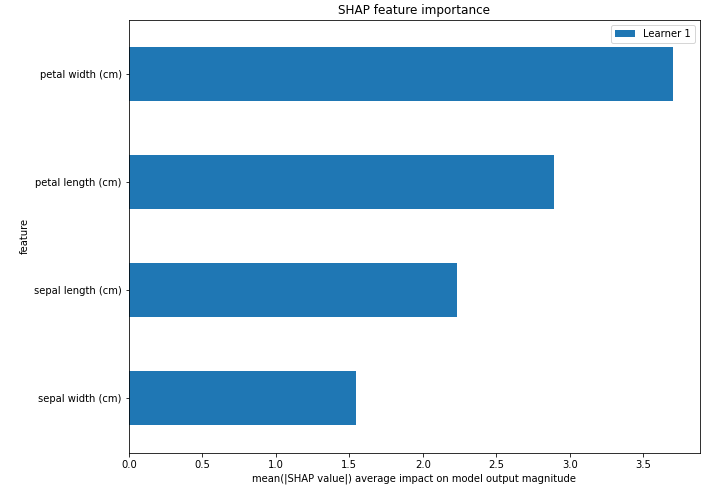
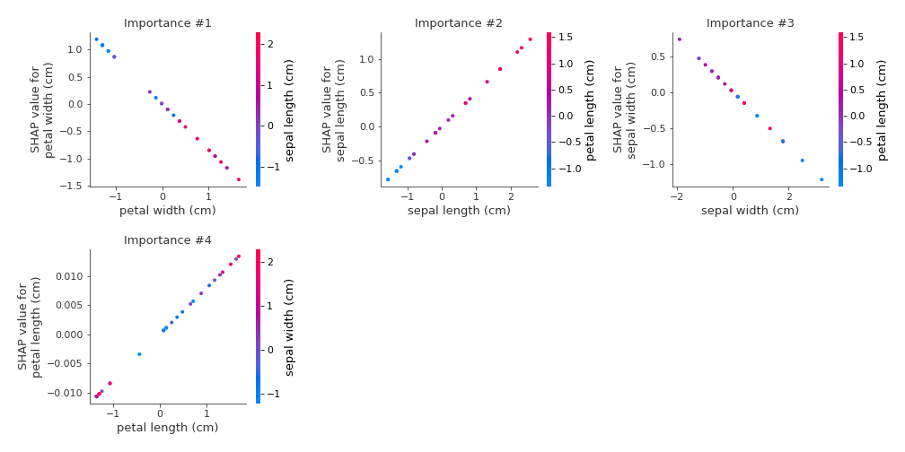
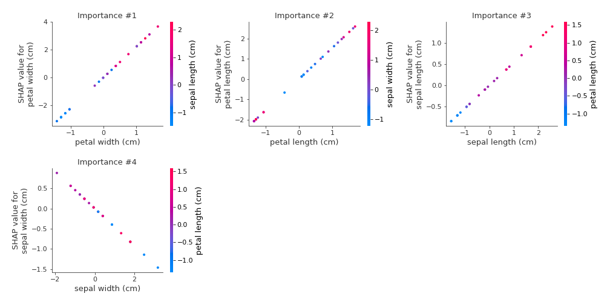
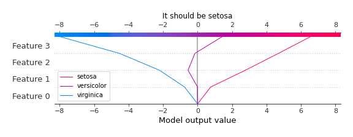

# Summary of 3_Linear

## Logistic Regression (Linear)
- **num_class**: 3
- **explain_level**: 2

## Validation
 - **validation_type**: split
 - **train_ratio**: 0.75
 - **shuffle**: True
 - **stratify**: True

## Optimized metric
logloss

## Training time

7.0 seconds

### Metric details
|           |   setosa |   versicolor |   virginica |   accuracy |   macro avg |   weighted avg |   logloss |
|:----------|---------:|-------------:|------------:|-----------:|------------:|---------------:|----------:|
| precision |        1 |            1 |           1 |          1 |           1 |              1 |  0.123994 |
| recall    |        1 |            1 |           1 |          1 |           1 |              1 |  0.123994 |
| f1-score  |        1 |            1 |           1 |          1 |           1 |              1 |  0.123994 |
| support   |       11 |           11 |          12 |          1 |          34 |             34 |  0.123994 |

## Confusion matrix
|                       |   Predicted as setosa |   Predicted as versicolor |   Predicted as virginica |
|:----------------------|----------------------:|--------------------------:|-------------------------:|
| Labeled as setosa     |                    11 |                         0 |                        0 |
| Labeled as versicolor |                     0 |                        11 |                        0 |
| Labeled as virginica  |                     0 |                         0 |                       12 |

## Learning curves

## Coefficients

### Coefficients learner #1
|                   |    setosa |   versicolor |   virginica |
|:------------------|----------:|-------------:|------------:|
| intercept         | -0.227322 |     1.78372  |   -1.5564   |
| sepal length (cm) | -1.03947  |     0.551319 |    0.48815  |
| sepal width (cm)  |  1.06056  |    -0.321485 |   -0.739071 |
| petal length (cm) | -1.65079  |    -0.337193 |    1.98798  |
| petal width (cm)  | -1.52061  |    -0.752418 |    2.27302  |

## Permutation-based Importance

## SHAP Importance

## SHAP Dependence plots

### Dependence setosa (Fold #1)

### Dependence versicolor (Fold #1)

### Dependence virginica (Fold #1)

## SHAP Decision plots

### Worst decisions for selected sample #1 (Fold #1)

### Worst decisions for selected sample #2 (Fold #1)

### Worst decisions for selected sample #3 (Fold #1)

### Worst decisions for selected sample #4 (Fold #1)

### Best decisions for selected sample #1 (Fold #1)

### Best decisions for selected sample #2 (Fold #1)

### Best decisions for selected sample #3 (Fold #1)

### Best decisions for selected sample #4 (Fold #1)
